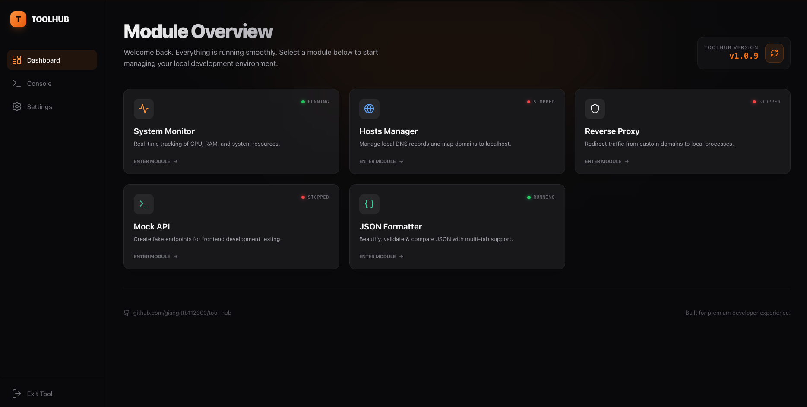

# 🚀 ToolHub - The Ultimate Developer Control Center

ToolHub là một nền tảng quản lý quy trình phát triển phần mềm (Developer Workflow Monitor) chạy native trên macOS, Linux và Windows. Ứng dụng cung cấp một giao diện Web UI hiện đại để theo dõi và quản lý các công cụ, dịch vụ và cấu hình hệ thống một cách tập trung.



---

## 🎯 1. Về ToolHub (About)

ToolHub được xây dựng trên triết lý **Micro-kernel**. Nhân của ứng dụng cực kỳ mỏng và nhẹ, trong khi mọi tính năng đều được triển khai dưới dạng các **Modules** độc lập:

- **System Monitor**: Theo dõi tài nguyên hệ thống (CPU/RAM) theo thời gian thực.
- **JSON Formatter**: Format, validate & so sánh JSON với multi-tab, collapsible tree view.
- **Hosts Manager**: Quản lý file hosts thông minh. _(coming soon)_
- **Reverse Proxy**: Điều hướng traffic linh hoạt. _(coming soon)_
- **Mock API**: Giả lập API cho quá trình phát triển Frontend. _(coming soon)_

---

## 🏗️ 2. Công nghệ cốt lõi (Tech Stack)

| Thành phần   | Công nghệ                           |
| :----------- | :---------------------------------- |
| **Runtime**  | Bun (Fast TS/JS Runtime)            |
| **Backend**  | Hono.js (Lightweight Web Framework) |
| **Frontend** | React + Vite                        |
| **Styling**  | Tailwind CSS + Shadcn UI            |
| **Database** | SQLite                              |

---

## 🚢 3. Cài đặt & Sử dụng (Installation)

### Yêu cầu

- [Node.js](https://nodejs.org) >= 18

### Cài đặt

```bash
npm install -g @giangnt112000/toolhub-cli
```

NPM sẽ tự động:

1. Tải binary ToolHub tương ứng với hệ điều hành của bạn.
2. Đăng ký lệnh `toolhub` vào Terminal để bạn gõ trực tiếp.

### Gỡ cài đặt

```bash
npm uninstall -g @giangnt112000/toolhub-cli
```

### Cập nhật

```bash
npm update -g @giangnt112000/toolhub-cli
```

---

## ⌨️ 4. Lệnh Command Line (CLI)

Sau khi cài đặt, lệnh `toolhub` có sẵn ngay trên Terminal:

| Lệnh             | Mô tả                                            |
| ---------------- | ------------------------------------------------ |
| `toolhub --help` | Hiển thị danh sách lệnh                          |
| `toolhub start`  | Khởi chạy dịch vụ chạy ngầm (Background Service) |
| `toolhub stop`   | Dừng dịch vụ                                     |
| `toolhub status` | Kiểm tra trạng thái Running/Stopped              |
| `toolhub update` | Hướng dẫn cập nhật                               |
| `toolhub -v`     | Kiểm tra phiên bản                               |

Sau khi `toolhub start`, mở trình duyệt tại **http://localhost:3001** để truy cập Web UI.

---

## 📂 5. Tài liệu chi tiết (Detailed Documentation)

Để tìm hiểu sâu hơn về kiến trúc, cách xây dựng module hoặc tiêu chuẩn thiết kế, vui lòng tham khảo:

- **[Quy trình Phát hành (Release Guide)](./TH-Release-Guide.md)**: Hướng dẫn quản lý version và push bản build lên GitHub.
- **[Đặc tả Kỹ thuật (Technical Specs)](./TH-Technical-Specs.md)**: Chi tiết về kiến trúc Micro-kernel, Module System, UI Design và Development Rules.
- **[Kế hoạch chuyển NPM (Migration Plan)](./docs/npm-migration-plan.md)**: Tài liệu thiết kế chuyển đổi sang NPM.

---

## 🏗️ 6. Cấu trúc Monorepo (Project Structure)

```plaintext
/toolhub
├── /apps
│   ├── /server             # Backend Core (Hono) & Modules
│   └── /client             # Frontend UI (React + Vite)
├── /packages
│   ├── /shared             # Types & Utils dùng chung
│   └── /cli                # NPM Distribution Package
├── /scripts                # Build & Release scripts
├── /docs                   # Tài liệu kỹ thuật
└── package.json
```

---

## 🛠️ 7. Dành cho nhà phát triển (Developer Guide)

### Phát triển

```bash
git clone https://github.com/giangittb112000/tool-hub.git
cd tool-hub
bun install
bun run dev
```

Server chạy trên port `3001`, Client trên port `5173` với Vite proxy.

### Build & Phát hành

1. **Build bản phát hành**: `bash scripts/release.sh` — tạo binary + frontend trong `dist/`.
2. **Publish version mới**: `bash scripts/publish.sh` — bump version, build, push Git tag.
3. **Upload GitHub Release**: Kéo 3 file từ `dist/` vào GitHub Release page.
4. **Publish NPM**: `cd packages/cli && npm publish --access public`.
